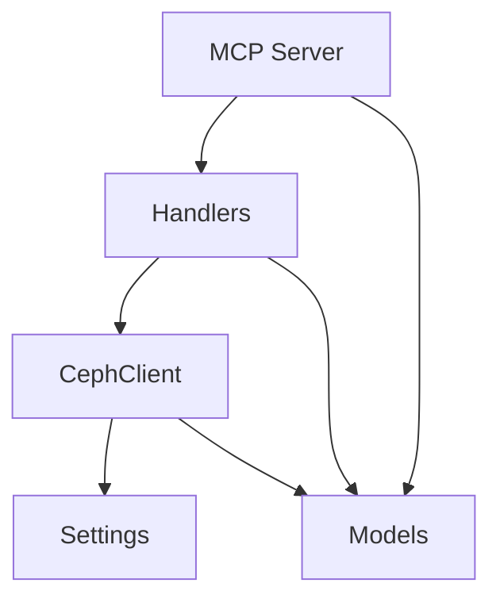

# Server logic flow

```mermaid
graph TD
    A[MCP Server] --> B[Handlers]
    A[MCP Server] --> C[Models]
    B[Handlers] --> D[CephClient]
    B[Handlers] --> C[Models]
    D[CephClient] --> E[Settings]
    D[CephClient] --> C[Models]
```
